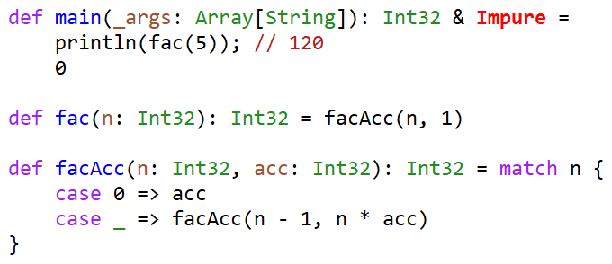

# Flix Mode

(Unofficial) Emacs major mode for the [Flix programming language](https://flix.dev).

*Features:*

* Syntax highlighting.
* Automatic indentation (work in progress).

## Installation

Download `flix-mode.el` and then do the following in Emacs:

<kbd>M-x package-install-file [RET] /path/to/flix-mode.el [RET]</kbd>

The built-in package manager in Emacs will then install the mode.

The mode is automatically loaded when you visit a `.flix` file.

## Known limitations

* The indentation heuristics are very much work in progress. They should mostly work for code that follows the style used in the official Flix examples. But multi-line function calls, lambdas, pipes etc. aren't handled, and placing comments in certain special places can cause the heuristics to indent incorrectly.
* As in many other major modes, the syntax highlighting is done via regular expressions; so strange source layout can break it.

## Contributing

Contributions are very welcome! If you're unfamiliar with Emacs Lisp, then 
the following resources are recommended reading:

* https://github.com/chrisdone/elisp-guide
* https://www.emacswiki.org/emacs/ModeTutorial
* https://www.emacswiki.org/emacs/SampleMode

## License

This project is distributed under the GNU General Public License, which can
be viewed by typing <kbd>C-h C-c</kbd> in Emacs.
